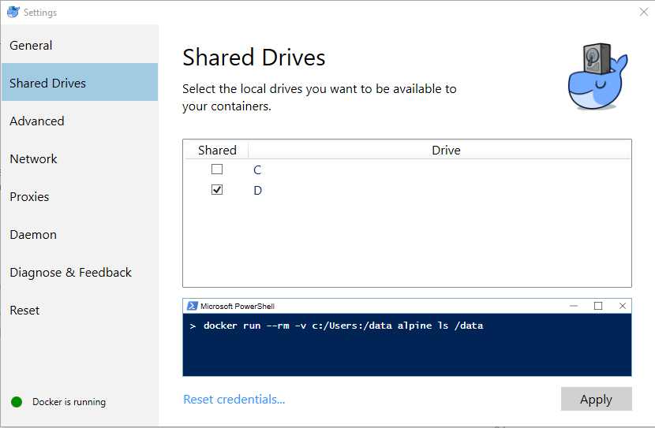
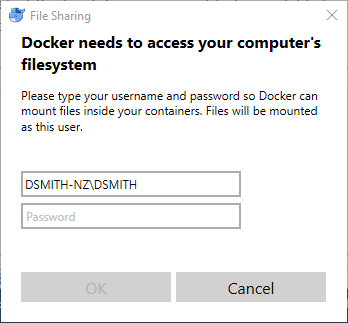

== Install Docker on Windows

The Docker site has a Windows installer. Follow the installation instructions.

After installation, you'll grant access to your Windows drive. Right-click on the tray icon and select Settings. Then choose Shared Drives:

You'll then need to enter your credentials:

